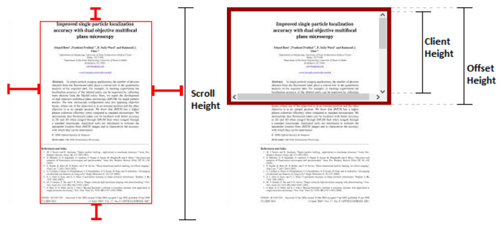

# DOM基础(一)之offsetHeight vs clientHeight vs scrollHeight

preface: 之前博客总是不更新, 总是想着等自己把所有东西梳理的井井有条之后再写, 额..可总也奈何自己懒货的毛病, 进展很不喜人. 所以还是想换个方式吧, 把自己学到的东西写一写, 再多的零也不上一个实际的1的吧. 回头再来系统的梳理这些东西.

## 要理解这几个概念得理解下[盒模型](https://developer.mozilla.org/en-US/docs/Web/CSS/CSS_Box_Model/Introduction_to_the_CSS_box_model)

[clientHeight](https://developer.mozilla.org/en-US/docs/Web/API/Element/clientHeight)

```
 returns the inner height of an element in pixels, including padding but not the horizontal scrollbar height, border, or margin
```

[offsetHeight](https://developer.mozilla.org/en-US/docs/Web/API/HTMLElement/offsetHeight)

```
is a measurement which includes the element borders, the element vertical padding, the element horizontal scrollbar (if present, if rendered) and the element CSS height.
```

[scrollHeight](https://developer.mozilla.org/en-US/docs/Web/API/Element/scrollHeight)

```
is a measurement of the height of an element's content including content not visible on the screen due to overflow
```

简单点说如下:

scrollHeight: content + padding
这里的content height也包含由于overflow而导致不可见的部分

clientHeight: content + padding
content可见高度 + padding

offsetHeight: content + padding + border + scrollbar
content可见高度 + padding + border + scrollbar



ps:
getComputedStyle拿到的height仅是元素content可见部分的高度
getBoundingRect拿到的height一般等于offsetHeight
