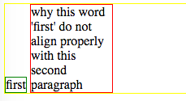
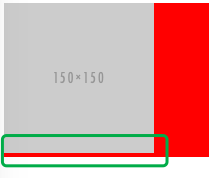

## css基础(二)之为什么这个行内元素对齐这么奇怪?

### 个人感觉css学习的瓶颈在于你要认识到自己需要去弄清楚一些东西, 而不是每次看到同一个问题都在chrome调试工具里试来试去, 2/3分钟过去了, 效果达到了才感叹一句: 怎么会和这个属性有关系? css真NM奇怪? 但是真的是它奇怪么? 还是你从来就没去想认真的了解过它的原理- -!(个人想法, 自我提醒之用, 不喜勿喷..)

今天看同事在讨论类似下图所示的页面:



大家也可以直接看[codepen](http://codepen.io/AndreGeng/pen/ZebMRX)上的snippet, 这里简化了页面里那些干拢元素, 问题是为什么first元素会像"有重力一样, 掉下来". 希望的效果是'first'元素和第二段文本的顶端对齐.

也许有的同学会想, vertical-align呀, 要么就是我大万能的flex. 是的这些都可以, 但这里我只想分析下为什么会出现这种现象.

首先很明显这是一个行内元素的对齐问题, 我们知道行内元素默认情况下是摆放在baseline上的, 即使行内文本为空也是如此, 这有时也会造成一些很奇怪的现象, 比方对如下的snippet:

```
<div class="container">

</div>
```

```
.container{
  background: red;
}
```

我们会发现img下方会出现一段空白, 这就是因为img是放在baseline上的, 它正文的空间其实是给行内文本留的'decending area'(找了半天不记得在哪儿看到的这个词了, 反正就是给像'y','q'这类字母用的区域)



要去除这个gap也很简单, 把img改为display: block, 或是改动下vertical-align的值

回到这里的问题, second元素的默认对齐属性也是baseline, 那关键问题就在于inline-block的元素的baseline到底在哪里? 这类问题怎么验证, 我们可以去翻下规范[w3c vertical-align](https://www.w3.org/TR/CSS2/visudet.html#leading)(vertical-align的介绍大家可以参见[这篇](http://andregeng.github.io/posts/10))

规范里面最重要一句如下:

```
The baseline of an 'inline-block' is the baseline of its last line box in the normal flow, unless it has either no in-flow line boxes or if its 'overflow' property has a computed value other than 'visible', in which case the baseline is the bottom margin edge.
```

翻译下就是:

'inline-block'元素的baseline就是元素内normal flow里最后一个行内框的baseline, 除非元素内没有处于normal flow的行内框或是元素的'overflow'属性得出的computed value不为'visible', 这两种情况下inline-block的baseline是元素底部margin的边缘.

以前还真没注意过规范中说的两种特殊情况, 所以没事儿的时候和自己较下真, 还是有点收获的😄

那这里的原因就比较清楚了, 可以看到first元素baseline和second元素的baseline是对齐的, 要是再往container内部加入一些文本, 可以发现这三者都是对齐的. 它们三个都应该是摆放在container元素行框的baseline上.(行框的高度是要恰好足以包含最高行内框的顶端和最低行内框的底端.) 那解决办法也就有了, 通过改变first元素的vertical-align为top就👌
